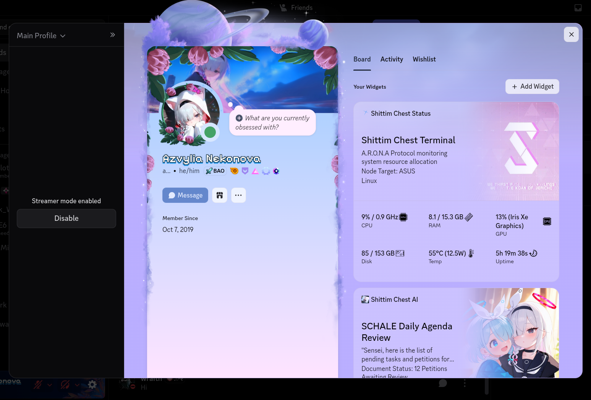
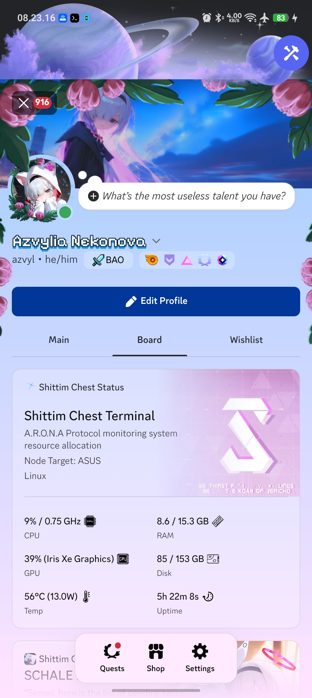
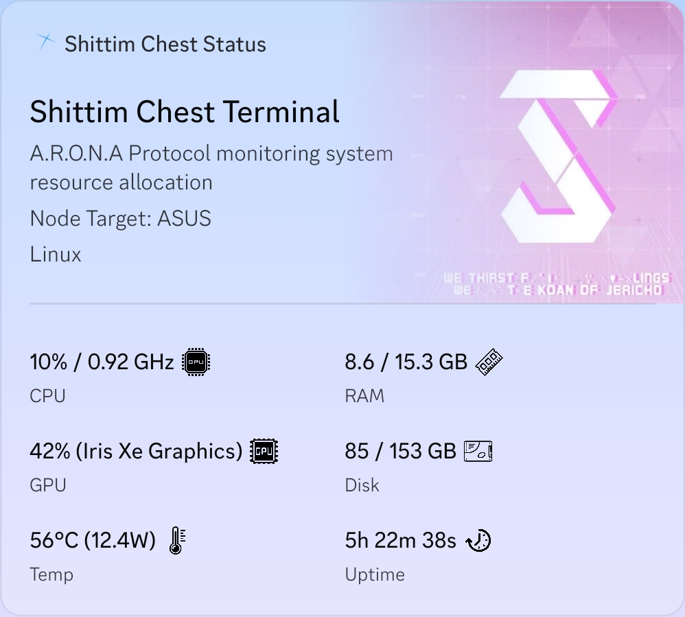
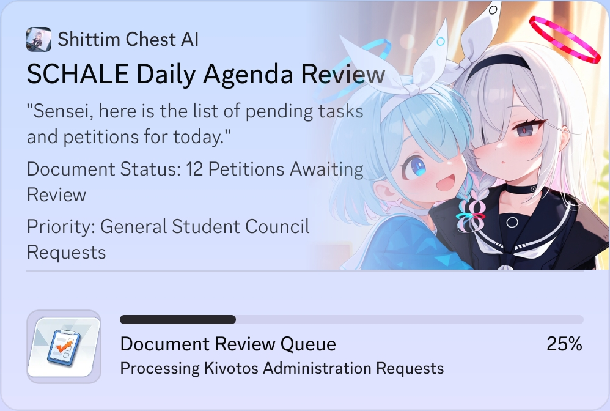
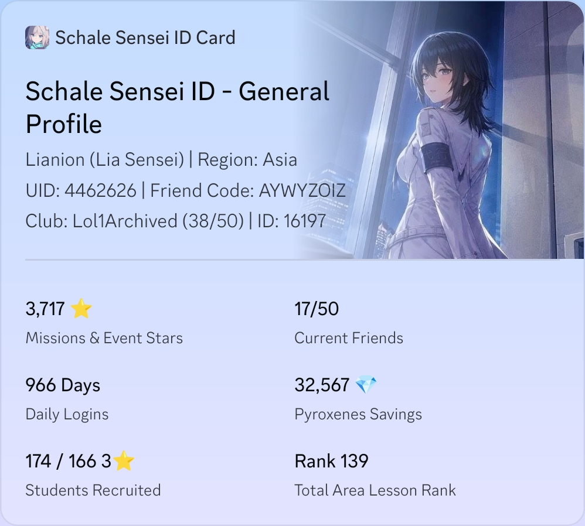
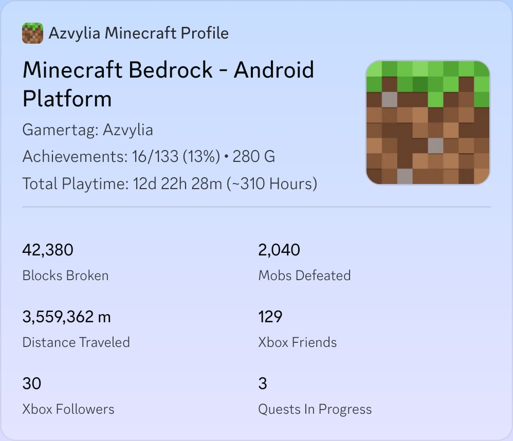
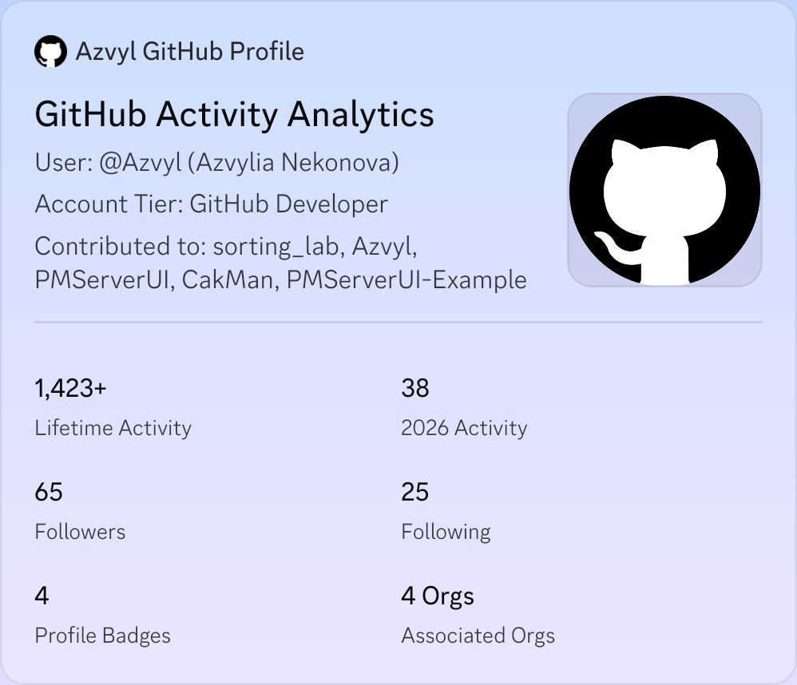

# Sanctum Terminal

**Sanctum Terminal** is my personal backend system that I built to manage my Discord bot, keep my Discord profile Game Stats Widgets updated, and automate audience interactions during my Minecraft live streams.

The system runs on the Deno (TypeScript) runtime across my personal devices (Laptop, Phone, and VPS). It uses Firebase Realtime Database for state synchronization and leader election failover, so if my laptop shuts down or goes offline, another node automatically takes over the services without downtime.

---

## Why I Built This

I had several distinct needs that I wanted to bring together under one unified orchestrator:
1. **Automated Discord Community Feeds**: I wanted a custom bot in my Discord server to track BMKG earthquake notices, severe weather warnings, and Minecraft updates automatically without having to check official sources manually.
2. **Dynamic Discord Profile Widgets**: I wanted to take advantage of Discord's **Game Stats Widgets** (a Discord feature that lets players showcase game progress and in-depth stats directly on their profiles) and cycle through dynamic data—ranging from my active device hardware telemetry and an assistant AI daily phase, to my Blue Archive account records, Minecraft gameplay statistics, and GitHub activity.
3. **Streamlined Live Streams**: Whenever I host Minecraft Bedrock multiplayer live streams, accepting Xbox friend requests, adding viewers to the server allowlist, and granting Creative mode manually becomes tedious. I wanted a bridge to automate those tasks straight from live chat.

**Sanctum Terminal** brings all these separate workflows into one central hub.

## What Does It Do?

### 1. Discord Bot
The bot handles automated background trackers and slash command utilities:
* **Minecraft Update Tracker**: Automatically monitors new release changelogs from Minecraft Feedback for both Minecraft Bedrock Edition (adapted from [xKingDark/minecraft-updates](https://github.com/xKingDark/minecraft-updates)) and Minecraft Java Edition. When a new release or preview drops, it creates a dedicated forum thread tagged with the update type and pings the corresponding role.
* **BMKG Earthquake & Weather Warnings**: Tracks real-time earthquake data across Indonesia from BMKG, along with severe weather alerts and maritime high wave warnings.
* **Stream & In-Game Chat Relay**: Forwards messages from both live stream platforms and the Minecraft Bedrock world into designated Discord forum threads.
* **Slash Commands**:
  * `/cuaca`: Checks Indonesian BMKG weather forecasts across all 4 administrative tiers (Province down to District/Village level).
  * `/mcping`: Inspects server status and MOTD for Minecraft Java and Bedrock servers (supporting both RakNet UDP and modern NetherNet WebRTC signaling).

### 2. Discord Game Stats Widgets

> **What are Game Stats Widgets?**  
> Discord Game Stats Widgets allow players to showcase their stats and gameplay progress—such as rankings, playtime, win rates, and custom data—directly on their Discord user profiles.

I use this feature to display and cycle 5 custom widget slots on my profile:

1. **Shittim Chest Status**: Displays live hardware telemetry (CPU, RAM, GPU, temperature, and battery power) of my active device. Priority is ranked hierarchically (Laptop → Phone → VPS). If both my laptop and phone are offline, it falls back to displaying VPS telemetry.
2. **Shittim Chest AI**: Updates the Game Stats widget according to a 12-phase daily schedule featuring Blue Archive's Arona and Plana characters.
3. **Schale Sensei ID Card**: Displays my personal Blue Archive account achievements (Sensei records, collection progress, battle history, and club status), rotating between display presets every few minutes.
4. **Azvylia Minecraft Profile**: Summarizes my Minecraft Bedrock track record (total playtime, mined blocks, defeated mobs, and Xbox achievements), alternating across Windows PC, Android, and Marketplace collection views.
5. **Azvyl GitHub Profile**: Pulls and displays my GitHub coding metrics (commits, stars, repository contributions, and pull requests) synced via a scheduled worker.

### 3. Minecraft Live Stream Bridge
Connects my live stream audience directly to my Minecraft Bedrock world:
* **Social Stream Ninja Integration**: Captures chat messages across streaming platforms using a local webhook. Viewers can type slash commands in the live chat:
  * `/friend <gamertag>`: Automatically accepts their friend request on the host's Xbox Live account.
  * `/allow <gamertag>`: Adds their gamertag to the Bedrock Dedicated Server allowlist.
  * `/creative <gamertag>`: Temporarily grants them Creative mode for a set duration before switching them back to Adventure mode.
* **Minecraft WebSocket Connection**: Communicates directly with the Minecraft client/server over WebSocket to detect when players join or leave, apply gamemode rules dynamically, and relay in-game chat back to Discord.

---

## Showcase

Here is how the widgets look on my Discord profile:

### Main Profile Preview

<table>
  <tr>
    <td align="center" valign="middle">
      
    </td>
    <td align="center" valign="middle">
      
    </td>
  </tr>
</table>

### Mobile Widget Views

<table>
  <tr>
    <td align="center" valign="top">
      
    </td>
    <td align="center" valign="top">
      
    </td>
  </tr>
  <tr>
    <td align="center" valign="top">
      
    </td>
    <td align="center" valign="top">
      
    </td>
  </tr>
  <tr>
    <td align="center" colspan="2">
      
    </td>
  </tr>
</table>

---

## Running the Project

This project runs on the [Deno](https://deno.com/) runtime:

```bash
# Start the orchestrator engine
deno task start

# Start in development mode (with file watcher)
deno task dev

# Run the GitHub metrics synchronization script
deno task sync:github

```

---

## License

Distributed under the [MIT](LICENSE) License.

---

## Acknowledgments

Parts of this repository were assisted by AI tooling:
- **Refactoring & Unification**: Merging three separate micro-services into this single unified terminal architecture was assisted by Google Gemini and Antigravity
- **Localization & Documentation**: Translation (ID-EN) and README enhancements were refined using Google Gemini